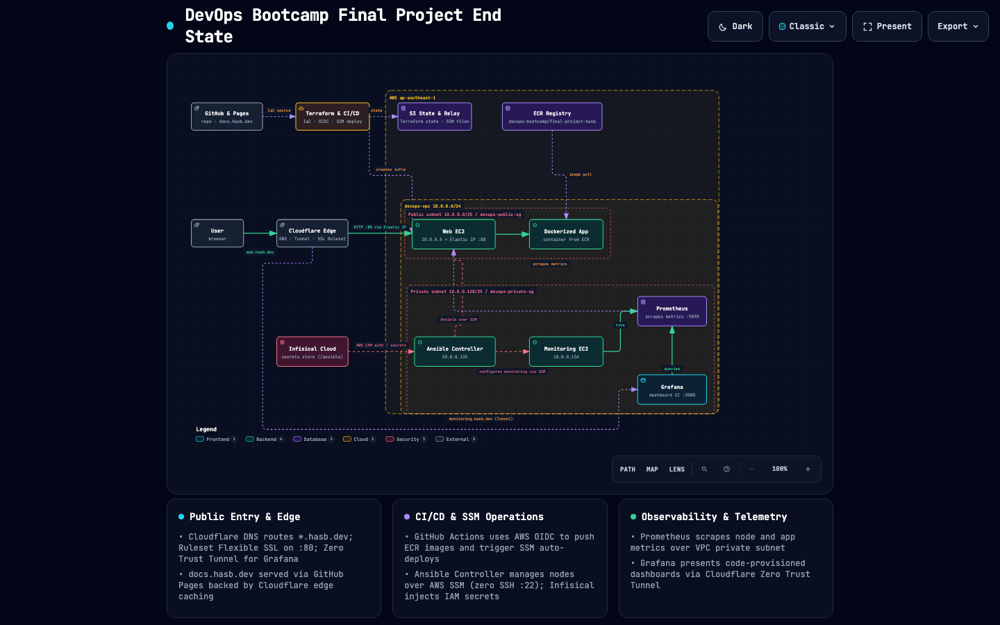
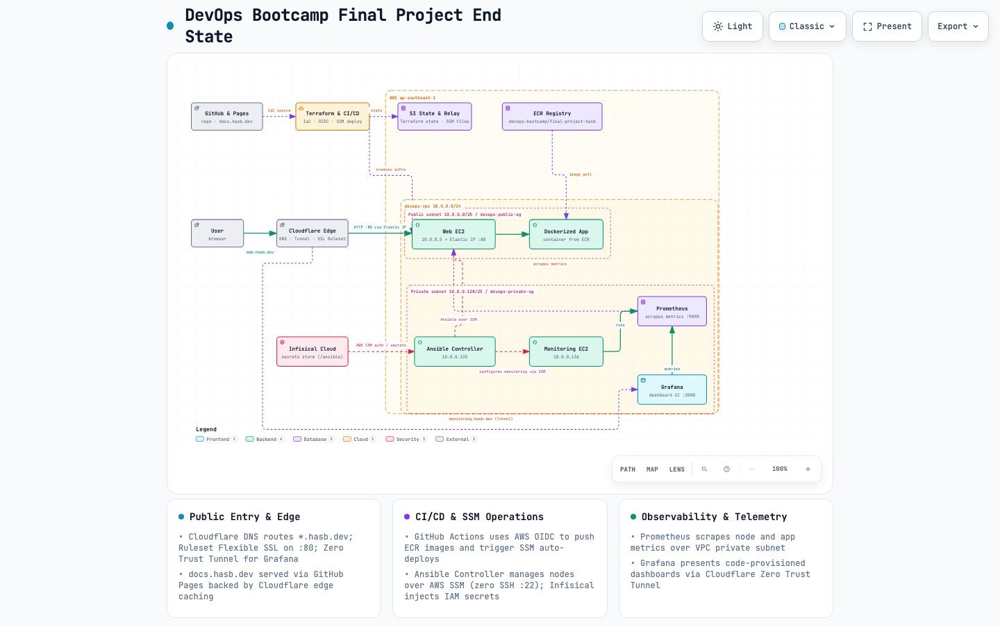

# DevOps Platform Documentation

Welcome to the engineering documentation portal for the **DevOps Bootcamp Capstone Platform** (`hasb.dev`).

This documentation covers the end-to-end cloud infrastructure, Zero-Trust network routing, configuration management, secrets lifecycle, and automated CI/CD deployment pipelines.

---

## Live Endpoints

!!! info "Endpoint Availability & Parked State"
    `docs.hasb.dev` is always live. `web.hasb.dev` and `monitoring.hasb.dev` are intentionally parked outside rehearsal/evaluation windows and become live after the documented [unpark procedure](runbook.md#path-1-park-runtime-resources-recommended-for-idle-intervals).

- __Web Application__

    ---

    Production frontend web application running in a Docker container on AWS EC2, protected by Cloudflare Anycast edge.

    [Open web.hasb.dev →](https://web.hasb.dev){:target="_blank" rel="noopener"}

- __Monitoring & Observability__

    ---

    Grafana observability dashboard visualizing Node Exporter host telemetry, routed privately over Cloudflare Zero Trust Tunnel.

    [Open monitoring.hasb.dev →](https://monitoring.hasb.dev){:target="_blank" rel="noopener"}

- __Documentation Portal__

    ---

    Automated technical runbook and architecture portal hosted on custom domain via GitHub Pages and Cloudflare edge.

    [https://docs.hasb.dev →](https://docs.hasb.dev)

- __Source Code Repository__

    ---

    Complete declarative Infrastructure as Code, Ansible playbooks, Docker Compose definitions, and CI/CD pipelines.

    [GitHub Repository →](https://github.com/hasB223/devops-bootcamp-project){:target="_blank" rel="noopener"}

---

## System Architecture Blueprint

!!! tip "Interactive Architecture Canvas"
    Click the blueprint preview below or [**Launch Full Interactive Canvas →**](assets/final-project-end-state.html){:target="_blank" rel="noopener"} for full-screen pan, zoom, component inspection, and flow tracing generated via Archify.

  
  

    <a href="assets/final-project-end-state.html" target="_blank" rel="noopener" class="md-button md-button--primary">
      Launch Interactive Architecture Canvas (Full Screen) →
    </a>
  

---

### End-State Topology Summary

  
  
  

    <a href="assets/end-state-topology-summary.svg" class="only-dark md-button" target="_blank" rel="noopener">
      Open Topology Summary Full Size →
    </a>
    <a href="assets/end-state-topology-summary.light.svg" class="only-light md-button" target="_blank" rel="noopener">
      Open Topology Summary Full Size →
    </a>
  

---

## Technical Documentation Guide

- __[System Architecture](architecture.md)__

    ---

    VPC topology, network segmentation, security group isolation, port matrices, and data flow specifications.

- __[Operational Runbook](runbook.md)__

    ---

    Step-by-step deployment instructions, verification procedures, parking protocols, and break-glass fallbacks.

- __[AWS Terraform IaC](terraform.md)__

    ---

    VPC, subnets, EC2 instances, security groups, IAM least-privilege roles, ECR repository, and S3 remote backend.

- __[Cloudflare Edge IaC](cloudflare.md)__

    ---

    Cloudflare Provider v5.24.0 automation: DNS records, Zero Trust Tunnel, and declarative configuration rulesets.

- __[Ansible Automation](ansible.md)__

    ---

    Ansible over SSM transport with zero SSH port 22, idempotent plays, and automated in-container Grafana password synchronization.

- __[Docker Compose Stack](docker.md)__

    ---

    Multi-container composition, health checks, restart policies, and named volume persistence.

- __[Observability & Monitoring](monitoring.md)__

    ---

    Prometheus scrape jobs, node_exporter metrics, and code-provisioned Grafana dashboards.

- __[CI/CD & Delivery](cicd.md)__

    ---

    GitHub Actions OIDC authentication, multi-linter PR gates, automated container builds, and zero-downtime SSM auto-deploys.

- __[Secrets Management](secrets-management.md)__

    ---

    Zero-secret repository hygiene, Infisical Cloud integration, machine identities, and Day-2 SQLite volume sync.

---

## Verified Infrastructure Evidence

All architectural components and operational tracks were verified during live integration and rehearsal runs, with artifact evidence preserved below:

| Milestone / Component | Verification Artifact | Description |
| :--- | :--- | :--- |
| **Web Application** | [`assets/web-app-live.png`](assets/web-app-live.png) | Three.js spaceship simulation rendering live over HTTPS at `web.hasb.dev`. |
| **Observability Dashboard** | [`assets/grafana-dashboard-live.png`](assets/grafana-dashboard-live.png) | Declarative Grafana dashboard tracking real-time CPU, RAM, and disk metrics. |
| **Interactive Topology** | [`assets/final-project-end-state.html`](assets/final-project-end-state.html) | Interactive standalone Archify canvas with full system topology. |
| **Secrets Architecture** | [`assets/secrets-management.architecture.json`](assets/secrets-management.architecture.json) | Complete diagrammatic model of the Infisical secrets delivery path. |
