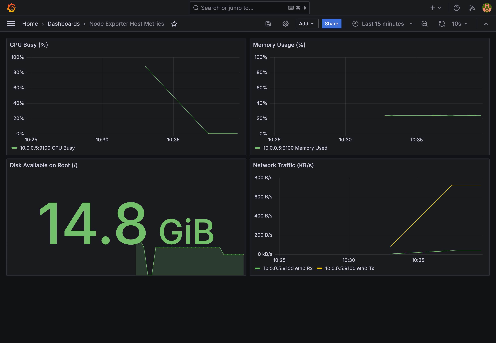

# Master Operational Runbook

Status: verified

This runbook provides the definitive, repeatable operational guide for provisioning, configuring, verifying, and tearing down the DevOps platform from zero to fully operational.

---

## Purpose

This runbook acts as the central reference for operations:
- Outlines the exact 0-to-1 provisioning sequence across Terraform, Docker, Ansible, and Cloudflare.
- Details end-to-end operational verification across all network, compute, application, and observability endpoints.
- Provides a **two-path cost management framework**: parking runtime resources to eliminate hourly costs during idle periods versus executing a full infrastructure teardown.

---

## Prerequisites & Tooling

Ensure the following tools and credentials are ready on the administrative machine:

| Tool | Minimum Version | Verification Command |
| --- | --- | --- |
| **Terraform** | `1.10.0+` | `terraform version` |
| **Ansible** | `2.16.0+` (core) | `ansible --version` |
| **AWS CLI** | `2.15.0+` | `aws --version` |
| **GitHub CLI** | `2.40.0+` | `gh --version` |
| **Docker Engine** | `24.0.0+` | `docker --version` |
| **Infisical CLI** | `0.30.0+` | `infisical --version` |

### AWS Authentication
Ensure the AWS CLI is configured with credentials authorized for VPC, EC2, ECR, IAM, and S3:
```bash
export AWS_REGION="ap-southeast-1"
aws sts get-caller-identity
```

---

## Phase-by-Phase 0-to-1 Build Sequence

```text
[Step 1: Terraform] ----> [Step 2: ECR Container] ----> [Step 3: Ansible Config]
   Provision VPC,            Build & Push Image           Install Docker & Run
   EC2, S3, IAM              via GitHub Actions           App Container on Web
                                                                   |
                                                                   v
[Step 6: Verified] <----- [Step 5: Cloudflare] <------- [Step 4: Monitoring]
   web.hasb.dev              DNS A-Record &               Prometheus & Grafana
   monitoring.hasb.dev       Zero Trust Tunnel            on Monitoring EC2
```

---

### Step 1: Terraform Infrastructure Provisioning

1. **Navigate to Terraform directory and initialize backend**:
   ```bash
   cd terraform
   terraform init
   ```
2. **Review execution plan**:
   ```bash
   terraform plan
   ```
   Confirm planned resources: VPC (`10.0.0.0/24`), public subnet (`10.0.0.0/25`), private subnet (`10.0.0.128/25`), Internet Gateway, NAT Gateway, 3 EC2 instances (`web`, `controller`, `monitoring`), ECR repository, and IAM OIDC provider/roles.

3. **Apply infrastructure**:
   ```bash
   terraform apply
   ```

4. **Record output values**:
   ```bash
   terraform output
   ```
   Key outputs:
   - `web_public_ip`: Elastic IP of the Web Server
   - `controller_private_ip`: `10.0.0.135`
   - `monitoring_private_ip`: `10.0.0.136`
   - `ecr_repository_url`: `164824552037.dkr.ecr.ap-southeast-1.amazonaws.com/devops-bootcamp/final-project-hasb`
   - `github_actions_role_arn`: `arn:aws:iam::164824552037:role/devops-github-actions-role`

---

### Step 2: Container Image Publishing to Private ECR

#### Automated Path (Preferred):
Pushes to the `main` branch affecting files under `app/**` automatically trigger `.github/workflows/build-push-ecr.yml`. The workflow authenticates to AWS ECR via OIDC and pushes image tags `${{ github.sha }}` and `latest`.

To trigger manually via GitHub CLI:
```bash
gh workflow run build-push-ecr.yml --ref main
```

#### Manual Fallback Path:
If publishing locally from an administrative workstation:
```bash
# Authenticate Docker to private ECR
aws ecr get-login-password --region ap-southeast-1 | docker login --username AWS --password-stdin 164824552037.dkr.ecr.ap-southeast-1.amazonaws.com

# Build and tag image
docker build -t 164824552037.dkr.ecr.ap-southeast-1.amazonaws.com/devops-bootcamp/final-project-hasb:latest -f app/Dockerfile app/

# Push to ECR
docker push 164824552037.dkr.ecr.ap-southeast-1.amazonaws.com/devops-bootcamp/final-project-hasb:latest
```

---

### Step 3: Ansible Configuration Management

Configuration orchestration is executed strictly from the **Ansible Controller** (`10.0.0.135`) inside the VPC, communicating to targets over AWS Systems Manager (`amazon.aws.aws_ssm`) with zero inbound SSH port 22 in Security Groups.

1. **Connect to Ansible Controller via AWS SSM Session Manager**:
   ```bash
   CONTROLLER_ID=$(aws ec2 describe-instances \
     --filters "Name=tag:Name,Values=ansible-controller" "Name=instance-state-name,Values=running" \
     --query "Reservations[0].Instances[0].InstanceId" --output text)

   aws ssm start-session --target "$CONTROLLER_ID"
   ```

2. **Switch to ubuntu user and navigate to repository**:
   ```bash
   sudo su - ubuntu
   cd ~/devops-bootcamp-project
   ```

3. **Target Node SSM Sudo Bootstrap (Rebuild / Recovery Procedure)**:
   Target nodes (`web-server` and `monitoring-server`) provisioned via Terraform automatically configure passwordless sudo for `ssm-user` via `user_data`. If instances are ever rebuilt or recovered manually, execute this one-time bootstrap from your workstation:
   ```bash
   aws ssm send-command \
     --targets "Key=tag:Role,Values=web,monitoring" \
     --document-name "AWS-RunShellScript" \
     --comment "Bootstrap ssm-user passwordless sudo for Ansible" \
     --parameters 'commands=[
       "set -e",
       "groupadd -f ansible-admin",
       "id ssm-user >/dev/null 2>&1 || useradd -m -s /bin/bash ssm-user",
       "usermod -aG ansible-admin ssm-user",
       "echo \"%ansible-admin ALL=(ALL) NOPASSWD:ALL\" > /etc/sudoers.d/ansible-admin",
       "chmod 0440 /etc/sudoers.d/ansible-admin",
       "visudo -cf /etc/sudoers.d/ansible-admin"
     ]'
   ```

4. **Install Controller Runtime Dependencies & Collections**:
   ```bash
   # Verify / install AWS session manager plugin
   which session-manager-plugin || {
     curl "https://s3.amazonaws.com/session-manager-downloads/plugin/latest/ubuntu_64bit/session-manager-plugin.deb" -o "/tmp/session-manager-plugin.deb"
     sudo dpkg -i /tmp/session-manager-plugin.deb
   }

   # Ensure python AWS SDK is installed
   python3 -c "import boto3, botocore" || pip install boto3 botocore

   # Install Ansible Galaxy dependencies
   ansible-galaxy role install -r ansible/requirements.yml -p ansible/roles
   ansible-galaxy collection install -r ansible/requirements.yml
   ```

5. **Verify inventory resolution (SSM by default, or SSH fallback)**:
   ```bash
   # Primary SSM Inventory (targeting EC2 Instance IDs via amazon.aws.aws_ssm)
   cp ansible/inventory-ssm.ini.example ansible/inventory-ssm.ini
   ansible-inventory -i ansible/inventory-ssm.ini --graph

   # Test SSM connectivity
   ansible -i ansible/inventory-ssm.ini targets -m ping
   ```

6. **Execute master playbook over SSM**:
   ```bash
   export GRAFANA_ADMIN_PASSWORD="<STRONG_PASSWORD_FROM_INFISICAL>"
   export CLOUDFLARE_TUNNEL_TOKEN="<TUNNEL_TOKEN_FROM_CLOUDFLARE_DASHBOARD>"

   ansible-playbook -i ansible/inventory-ssm.ini ansible/playbook.yml
   ```

7. **Verify idempotency**:
   Run the playbook a second time:
   ```bash
   ansible-playbook -i ansible/inventory-ssm.ini ansible/playbook.yml
   ```
   Confirm the summary returns `changed=0`.

> [!TIP]
> **Break-Glass SSH Fallback**: If emergency access is ever required, port 22 can be restored by reapplying Terraform with `-var="enable_ssh_ingress=true"`. You can then run using `ansible/inventory.ini`.

---

### Step 4: Monitoring Stack Verification

From the Ansible Controller or via SSM on the Monitoring Server (`10.0.0.136`):

1. **Verify Prometheus scrape health**:
   ```bash
   curl -s http://10.0.0.136:9090/api/v1/targets | jq '.data.activeTargets[] | {job: .labels.job, instance: .labels.instance, health: .health}'
   ```
   Expected output:
   - `job: "web-server"`, `instance: "10.0.0.5:9100"`, `health: "up"`
   - `job: "prometheus"`, `instance: "localhost:9090"`, `health: "up"`

2. **Verify Grafana health endpoint**:
   ```bash
   curl -s http://10.0.0.136:3000/api/health
   ```
   Expected: `{"commit":"...","database":"ok","version":"11.1.0"}`.

---

### Step 5: Cloudflare Edge Routing & Tunnel Activation

1. **DNS A-Record for Web**:
   - In Cloudflare Dashboard (**DNS** -> **Records**):
     - Name: `web`
     - IPv4 Address: `<web_public_ip>` (Elastic IP)
     - Proxy status: **Proxied** (Orange Cloud)

2. **Zero Trust Tunnel for Monitoring**:
   - In Cloudflare Zero Trust Dashboard (**Networks** -> **Tunnels**):
     - Tunnel name: `devops-monitoring-tunnel`
     - Public Hostname: `monitoring.hasb.dev`
     - Service: `HTTP` -> `localhost:3000`

---

## End-to-End Verification Suite

Execute these verification checks from any external machine:

```bash
# 1. Verify Public Web Application
curl -I https://web.hasb.dev

# 2. Verify Observability Access via Cloudflare Tunnel
curl -I https://monitoring.hasb.dev

# 3. Verify Documentation Portal on Custom Domain
curl -I https://docs.hasb.dev

# 3b. Verify Legacy GitHub Pages URL Redirects to Custom Domain
curl -I https://hasb223.github.io/devops-bootcamp-project/

# 4. Confirm Monitoring Server has zero public inbound ports
# (Should timeout or fail to connect from external network)
nc -z -w 3 monitoring.hasb.dev 22 || echo "Port 22 closed as expected"
nc -z -w 3 monitoring.hasb.dev 3000 || echo "Port 3000 closed as expected"
```

Expected responses:
- `https://web.hasb.dev`: `HTTP/2 200`
- `https://monitoring.hasb.dev`: `HTTP/2 200` or `302` (Redirect to Grafana `/login`)
- `https://docs.hasb.dev`: `HTTP/2 200`
- `https://hasb223.github.io/devops-bootcamp-project/`: `HTTP/2 301` (Redirect to `https://docs.hasb.dev/`)

### Live Integration Evidence

End-to-end integration verified on live cloud infrastructure:

- **Web Application (`web.hasb.dev`)**: Responsive application UI served by Nginx container with TLS terminated at Cloudflare edge.
  

- **Observability Dashboard (`monitoring.hasb.dev`)**: Real-time host metrics scraped from `10.0.0.5:9100` and visualized in Grafana over Cloudflare Zero Trust Tunnel.
  

---

## Two-Path Cost Management & Teardown

To prevent unnecessary AWS cloud spend, the platform supports two distinct cost-reduction paths depending on operational requirements.

```text
+-------------------------------------------------------------------------+
| Path 1: Park Runtime Resources (Save ~$35/month, retain assets & state)  |
| - Stop EC2 instances                                                    |
| - Destroy NAT Gateway & Elastic IP                                      |
| - Retain: VPC, Subnets, ECR repository & images, IAM roles, S3 backend   |
+-------------------------------------------------------------------------+
                                    OR
+-------------------------------------------------------------------------+
| Path 2: Full Infrastructure Teardown (Clean slate)                      |
| - Execute terraform destroy                                             |
| - Removes: All EC2, NAT, VPC, ECR, and IAM resources                    |
| - Retains: S3 remote state bucket (contains versioned state files)      |
+-------------------------------------------------------------------------+
```

### Path 1: Park Runtime Resources (Recommended for Idle Intervals)

The primary continuous cost drivers in this architecture are the **NAT Gateway** (~$32.40/month plus data processing) and **EC2 compute hours**. During idle intervals, park the runtime while preserving networking, ECR container images, and IAM identities:

1. **Stop EC2 Instances**:
   ```bash
   INSTANCE_IDS=$(aws ec2 describe-instances \
     --filters "Name=tag:Project,Values=devops-bootcamp-project" "Name=instance-state-name,Values=running" \
     --query "Reservations[].Instances[].InstanceId" --output text)

   if [ -n "$INSTANCE_IDS" ]; then
     aws ec2 stop-instances --instance-ids $INSTANCE_IDS
     echo "Stopped compute instances: $INSTANCE_IDS"
   fi
   ```

2. **Destroy NAT Gateway & Associated Elastic IP**:
   ```bash
   cd terraform
   terraform destroy -target=aws_nat_gateway.gw -target=aws_eip.nat -auto-approve
   ```

3. **What Persists vs What is Stopped**:
   - **Billable Spend Eliminated**: EC2 compute per-second charges and NAT Gateway hourly charges.
   - **Persistent Assets Preserved**: VPC network topology, subnets, route tables, security groups, private ECR repository with published images, IAM roles, and S3 remote state.

4. **Resuming from Parked State**:
   ```bash
   cd terraform
   terraform apply -target=aws_eip.nat -target=aws_nat_gateway.gw -auto-approve
   aws ec2 start-instances --instance-ids <INSTANCE_IDS>
   ```

---

### Path 2: Full Infrastructure Teardown

When the entire environment is no longer needed:

1. **Review destruction plan**:
   ```bash
   cd terraform
   terraform plan -destroy
   ```

2. **Execute destruction**:
   ```bash
   terraform destroy -auto-approve
   ```

3. **Important Persistence Clarification**:
   - `terraform destroy` tears down **all resources managed in the state**, including all EC2 instances, the Elastic IP, the NAT Gateway, the VPC, subnets, security groups, the ECR repository, and the IAM OIDC provider and roles.
   - The S3 remote state bucket (`devops-bootcamp-terraform-hasb`) persists independently and retains the versioned `.tfstate` files.

---

## Troubleshooting Guide

### 1. Web Container Fails to Pull Image from ECR
- **Symptom**: `docker pull` fails on Web EC2 with `no basic auth credentials`.
- **Cause**: The EC2 instance profile `devops-web-profile` lacks `ecr:GetAuthorizationToken` or token expired.
- **Resolution**: Re-authenticate Docker via the instance role:
  ```bash
  aws ecr get-login-password --region ap-southeast-1 | docker login --username AWS --password-stdin 164824552037.dkr.ecr.ap-southeast-1.amazonaws.com
  ```

### 2. Monitoring Server Cannot Pull Packages or Reach Cloudflare
- **Symptom**: `apt update` times out; `cloudflared` logs connection errors.
- **Cause**: NAT Gateway is missing, stopped, or the private route table default route `0.0.0.0/0` does not point to the NAT Gateway.
- **Resolution**: Confirm NAT Gateway state:
  ```bash
  aws ec2 describe-nat-gateways --filter "Name=vpc-id,Values=<VPC_ID>" --query "NatGateways[*].[NatGatewayId,State]"
  ```

### 3. Cloudflare Tunnel Shows Status "Inactive"
- **Symptom**: `https://monitoring.hasb.dev` returns Cloudflare Error 1033.
- **Cause**: The `cloudflared` container is not running or the tunnel token is invalid.
- **Resolution**: Check container logs on the Monitoring Server:
  ```bash
  docker logs cloudflared --tail 50
  ```
  Ensure `CLOUDFLARE_TUNNEL_TOKEN` matches the active token in Cloudflare Zero Trust dashboard.
